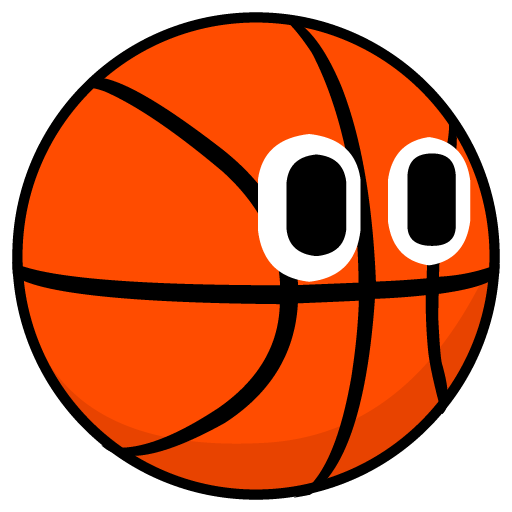

# Ballin N Fallin

A Physics-based multiplayer party game in development

---

## Built With
* **Engine:** [Godot 4.3](https://godotengine.org/license/)
* **Language:** C#

## Licenses

### Code Licenses
* All software code and Godot structural files including scripts, scenes, resources, and materials are licensed under the [GNU Affero General Public License v3.0 or later (AGPL-3.0-or-later)](LICENSE).
* To allow the game to be distributed on PC storefronts, this project uses a specific Section 7 exception to allow linking with the Steamworks SDK. By submitting a pull request, you explicitly agree to license your code under the AGPLv3 or later, and agree to the terms outlined in the [LICENSE-ADDENDUM.md](LICENSE-ADDENDUM.md) file.

### Asset Licenses
Media files located in this repository (including, but not limited to, images, audio, and fonts) are not covered by the AGPL code license.

* **Proprietary Assets:** Unless otherwise noted, all original game art, images, sprites, and branding are proprietary (All Rights Reserved).
* **Third-Party Assets:** Certain media files, such as fonts, audio, and specific images, are used under their respective open-source or commercial licenses (e.g., SIL Open Font License, CC-BY). Please refer to the `ATTRIBUTIONS.txt` file or the local credits files within those specific asset folders for their exact terms.